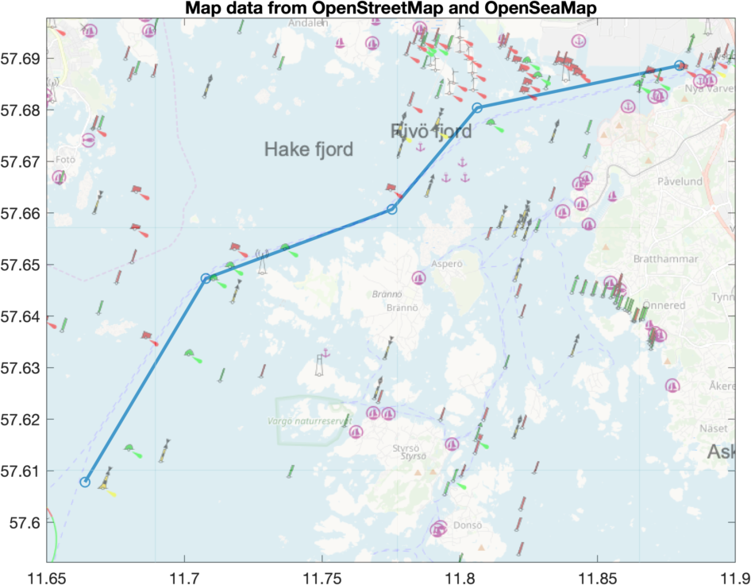

# plot_openstreetmap
MATLAB function for plotting maps from OpenStreetMap and OpenSeaMap on the background of a figure.

# Example

Plotting several points on a map in Gothenburg archipelago and adding base map from OpenStreetMap (water and land) and overlaying with sea markings from OpenSeaMap.

```matlab
x = [11.6639 11.7078 11.7754 11.8063 11.8797];
y = [57.6078 57.6473 57.6607 57.6804 57.6886];
figure; plot(x, y, 'o-', 'LineWidth', 2);
hBase = plot_openstreetmap('Alpha', 0.4, 'Scale', 2);  % Basemap.
hSea  = plot_openstreetmap('Alpha', 0.5, 'Scale', 2, 'BaseUrl', "http://tiles.openseamap.org/seamark");  % Sea marks.
```


